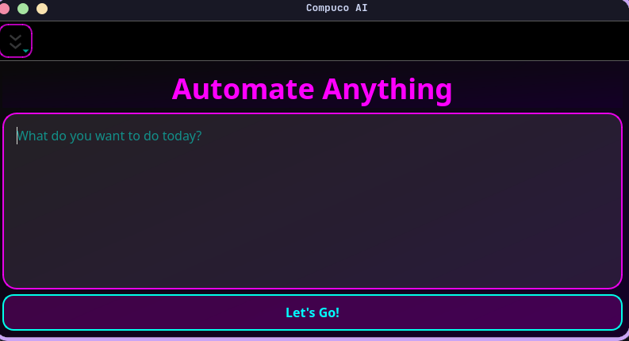
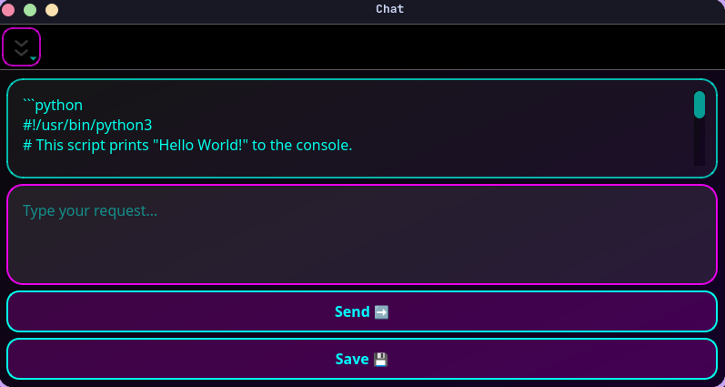
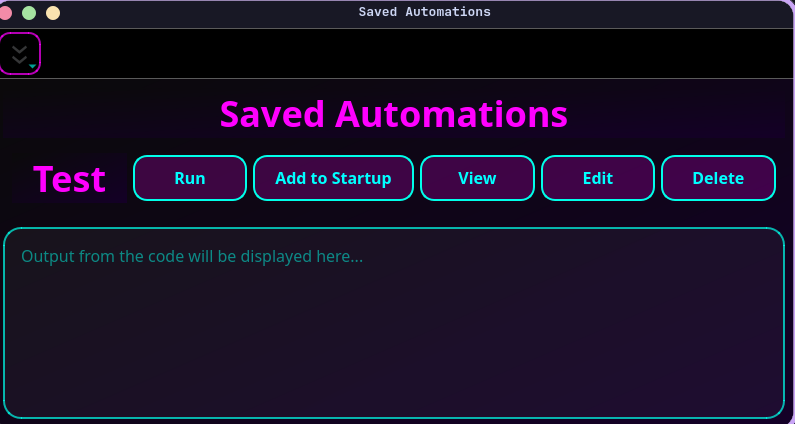
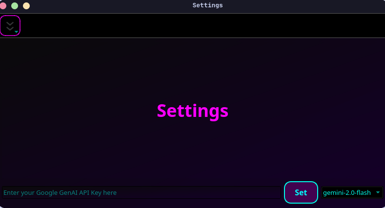

<div align="center">
  
  <h1>Compuco-AI</h1>
</div>

<p align="center">
  <strong>Your personal AI assistant for automating anything on your desktop.</strong>
  <br />
  Bring shortcuts and customization to Windows and Linux through a simple, futuristic AI interface!
</p>

<p align="center">
  
  
  
</p>

---

### 🪲 Bugs (‼️: Major, ❗: Minor)
 - **‼️ Ouput doesn't show, so no evidence that "Run" button works.**

## ✨ Features

- **🤖 AI-Powered Automation**: Describe what you want to do in plain English, and let the AI generate the necessary script.
- **🌐 Multi-Language Support**: Generates code in **Bash** or **Python** to best suit your task and platform.
- **💾 Save & Manage**: Store your favorite automations, then view, edit, or delete them with ease from the database.
- **▶️ One-Click Execution**: Run your saved scripts directly from the app and see their output.
- **🚀 Startup Integration**: Easily add any automation to your system's startup sequence.
- **🎨 Cyberpunk UI**: A sleek, modern interface built with PySide6, featuring a cool, neon aesthetic.
- **⚙️ Customizable**: Change your Google GenAI API key and select your preferred AI model right from the settings menu.

## 📸 Screenshots

*A preview of the Compuco-AI interface.*

| Main Window | Chat Window |
| :---: | :---: |
|  |  |

| Saved Automations | Settings |
| :---: | :---: |
|  |  |

## 🛠️ Tech Stack

- **Backend**: Python
- **GUI**: PySide6
- **AI**: Google Gemini
- **Database**: SQLite

## 🚀 Getting Started

Follow these instructions to get a copy of the project up and running on your local machine.

### Prerequisites

- Python 3.1+
- An API key from **[Google AI Studio](https://aistudio.google.com/app/apikey)**.

### Installation

1.  **Clone the repository:**
    ```sh
    git clone https://github.com/MoofireX/Compuco-AI.git
    cd Compuco-AI
    ```

2.  **Install the required packages:**
    ```sh
    pip install -r requirements.txt
    ```

3.  **Set up your API key:**
    You need to provide your Google GenAI API key. You can do this in two ways:

    - **Environment Variable (Recommended)**: Create an environment variable named `GOOGLE_API` and set its value to your key.
        <details>
        <summary>Click to see how to set an environment variable</summary>

        **Linux/macOS:**
        ```sh
        export GOOGLE_API="YOUR_API_KEY_HERE"
        ```
        *To make it permanent, add this line to your `~/.bashrc` or `~/.zshrc` file.*

        **Windows (PowerShell):**
        ```powershell
        $env:GOOGLE_API="YOUR_API_KEY_HERE"
        ```
        *To set it permanently, use the System Properties dialog.*
        </details>

    - **In-App Settings**: Launch the application and navigate to the **Settings** menu to enter your API key directly.

4.  **Run the application:**
    ```sh
    python compucoAI.py
    ```

## 💡 How to Use

1.  Launch the app. You'll be greeted with the main prompt.
2.  Type a request for something you want to automate (e.g., "organize all jpg files on my desktop into a folder called 'Images'").
3.  Click **"Let's Go!"**. The AI will generate a script in a new chat window.
4.  In the chat window, you can refine the script by sending more instructions to the AI.
5.  Once you're happy, click **"Save 💾"** and give your automation a name.
6.  Access, run, or edit your saved automations at any time from the **"Saved Automations"** menu item.
